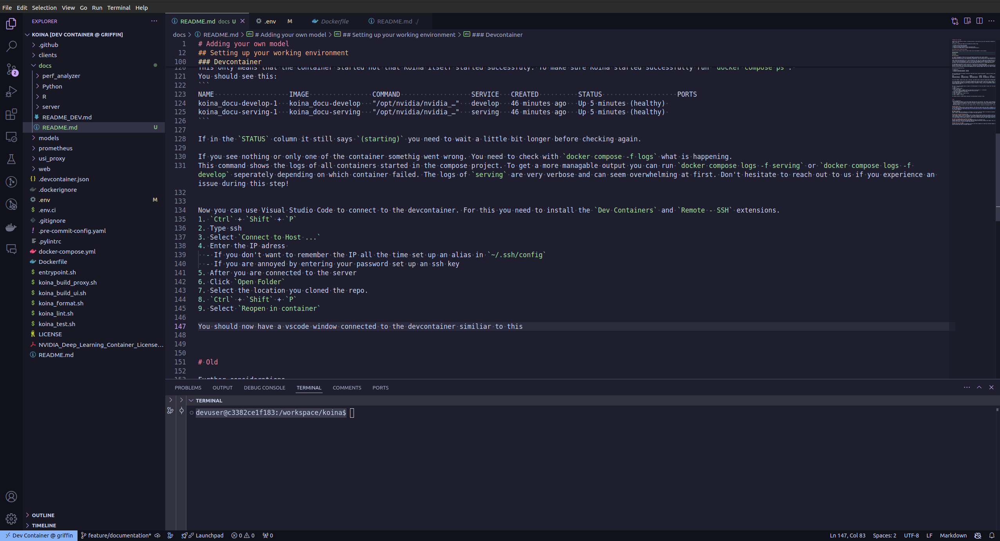

# Adding Your Own Model

Thank you for contributing to Koina. If at any point during the process you run into issues, don't hesitate to open an issue on [GitHub](https://github.com/wilhelm-lab/koina/issues); we are happy to help you!

The process of adding your model can be divided into several steps:

1. Setting up your working environment
2. Adding the core model (and testing it)
3. Adding pre- and post-processing steps (and testing them)
4. Creating an ensemble model to connect everything (and testing it)

## Setting Up Your Working Environment

Before we start working on Koina, we need to make sure our environment is set up properly.

### GPU Drivers

First, we should ensure that the drivers for our GPU are set up properly. If you run `nvidia-smi`, you should see an overview of the GPUs in your server similar to this:

```
+-----------------------------------------------------------------------------------------+
| NVIDIA-SMI 550.90.07              Driver Version: 550.90.07      CUDA Version: 12.4     |
|-----------------------------------------+------------------------+----------------------+
| GPU  Name                 Persistence-M | Bus-Id          Disp.A | Volatile Uncorr. ECC |
| Fan  Temp   Perf          Pwr:Usage/Cap |           Memory-Usage | GPU-Util  Compute M. |
|                                         |                        |               MIG M. |
|=========================================+========================+======================|
|   0  NVIDIA GeForce GTX 1080        On  |   00000000:02:00.0 Off |                  N/A |
| 33%   30C    P8              6W /  200W |       2MiB /   8192MiB |      0%      Default |
|                                         |                        |                  N/A |
+-----------------------------------------+------------------------+----------------------+
|   1  NVIDIA GeForce GTX 1080        On  |   00000000:03:00.0 Off |                  N/A |
| 33%   22C    P8              5W /  200W |       2MiB /   8192MiB |      0%      Default |
|                                         |                        |                  N/A |
+-----------------------------------------+------------------------+----------------------+
|   2  NVIDIA GeForce GTX 1080        On  |   00000000:81:00.0 Off |                  N/A |
| 33%   24C    P8              5W /  200W |       2MiB /   8192MiB |      0%      Default |
|                                         |                        |                  N/A |
+-----------------------------------------+------------------------+----------------------+
|   3  NVIDIA GeForce GTX 1080        On  |   00000000:82:00.0 Off |                  N/A |
| 33%   23C    P8              5W /  200W |       2MiB /   8192MiB |      0%      Default |
|                                         |                        |                  N/A |
+-----------------------------------------+------------------------+----------------------+
                                                                                         
+-----------------------------------------------------------------------------------------+
| Processes:                                                                              |
|  GPU   GI   CI        PID   Type   Process name                              GPU Memory |
|        ID   ID                                                               Usage      |
|=========================================================================================|
|                                                                                         |
+-----------------------------------------------------------------------------------------+
```

If you see any error messages, you need to set up your GPU drivers first. If you are using Ubuntu, you can use [Lambda Stack](https://lambdalabs.com/lambda-stack-deep-learning-software) for this. This has always worked well for us.

### Docker

We recommend setting up Docker from scratch as described in the [official documentation](https://docs.docker.com/engine/install/) to avoid issues related to different setups.

<details>
  <summary>Here are the commands you need to run if you are using Ubuntu</summary>

```bash
for pkg in docker.io docker-doc docker-compose docker-compose-v2 podman-docker containerd runc; do sudo apt-get remove $pkg; done
```
```bash
# Add Docker's official GPG key:
sudo apt-get update
sudo apt-get install ca-certificates curl
sudo install -m 0755 -d /etc/apt/keyrings
sudo curl -fsSL https://download.docker.com/linux/ubuntu/gpg -o /etc/apt/keyrings/docker.asc
sudo chmod a+r /etc/apt/keyrings/docker.asc

# Add the repository to Apt sources:
echo \
  "deb [arch=$(dpkg --print-architecture) signed-by=/etc/apt/keyrings/docker.asc] https://download.docker.com/linux/ubuntu \
  $(. /etc/os-release && echo "$VERSION_CODENAME") stable" | \
  sudo tee /etc/apt/sources.list.d/docker.list > /dev/null
sudo apt-get update
```

```bash
sudo apt-get install docker-ce docker-ce-cli containerd.io docker-buildx-plugin docker-compose-plugin
```
</details>

Verify that Docker is working. When running this command, you should see a hello world message from Docker.
```bash
docker run hello-world
```

Verify that GPUs are visible for Docker. The output you get from this should look identical to running `nvidia-smi` without Docker.
```bash
docker run -it --gpus all ubuntu:latest nvidia-smi 
```

### Devcontainer

To simplify the development of Koina, we set up a development environment using `docker compose`. We *highly* recommend using it for development. Any additional time you spend during setup is more than outweighed later on. Trust me on this. Preferably, you should also use it with [Visual Studio Code](https://code.visualstudio.com/), which provides you a nice IDE directly within the devcontainer.

After cloning the repo, open the `.env` file and change the `GID` and `UID` to what you see when you run `id -u` and `id -g`, respectively. This avoids permission issues when you create files inside the devcontainer. In the `.env`, you can also specify which GPU should be used by setting `GPU_DEVICE` to the id you can see using `nvidia-smi`. `COMPOSE_PROJECT_NAME` is used to help you differentiate if there are multiple Koina development projects running, which one is which. `MODEL_PATTERN` is a pattern to select which models are loaded when starting the server; you can provide both patterns and exact model names like `Prosit_*` or `Prosit_2019_intensity`. 

The development environment is split into two parts: the Koina server and the devcontainer. To start the containers, run `docker compose up -d --build`. This will pull the base Docker images, set up the local environment, and then start the container. Because the base images we are using are big and the container we are building includes a lot of required tools, this will take a while the first time you are running it. The first time, you can expect 10-15 minutes depending on your connection speed. After the first time, it should take only seconds due to Docker caching the results.

At the end, you should see this:
```
[+] Running 2/2
 ✔ Container koina_docu-serving-1  Started
 ✔ Container koina_docu-develop-1  Started
```

This only means that the container started, not that Koina itself started successfully. To make sure Koina started successfully, run `docker compose ps`. You should see this:
```
NAME                   IMAGE                COMMAND                  SERVICE   CREATED          STATUS                   PORTS
koina_docu-develop-1   koina_docu-develop   "/opt/nvidia/nvidia_…"   develop   46 minutes ago   Up 5 minutes (healthy) 
koina_docu-serving-1   koina_docu-serving   "/opt/nvidia/nvidia_…"   serving   46 minutes ago   Up 5 minutes (healthy) 
```

If in the `STATUS` column it still says `(starting)`, you need to wait a little bit longer before checking again.

If you see nothing or only one of the containers, something went wrong. You need to check with `docker compose -f logs` what is happening. This command shows the logs of all containers started in the compose project. To get a more manageable output, you can run `docker compose logs -f serving` or `docker compose logs -f develop` separately, depending on which container failed. The logs of `serving` are very verbose and can seem overwhelming at first. Don't hesitate to reach out to us if you experience an issue during this step!

Now you can use Visual Studio Code to connect to the devcontainer. For this, you need to install the `Dev Containers` and `Remote - SSH` extensions.
1. `Ctrl` + `Shift` + `P`
2. Type ssh
3. Select `Connect to Host ...`
4. Enter the IP address 
  - If you don't want to remember the IP all the time, set up an alias in `~/.ssh/config`
  - If you are annoyed by entering your password, set up an SSH key
5. After you are connected to the server
6. Click `Open Folder`
7. Select the location where you cloned the repo.
8. `Ctrl` + `Shift` + `P`
9. Select `Reopen in container`

You should now have a VSCode window connected to the devcontainer similar to this:
With the repo file structure on the left-hand side and a Terminal window. If the terminal prompt says `devuser@<SomeHash>:/workspace/koina$`, you are inside the container.


Let's make sure everything was set up correctly by running the tests for the Python client, which are also used to ensure prediction accuracy for the models hosted on Koina.
1. `cd clients/python`
2. `poetry run pytest`

If you only loaded specific models, you can run only tests for that model by specifying the corresponding file like this: `poetry run pytest test/Prosit/test_Prosit_2019_intensity.py`.

### Repo File Structure

The high-level structure of the repo is:

- `.github/`: Folder for the GitHub CI pipeline configuration
- `client/`: Folder for the clients used to simplify interfacing with Koina.
- `docs/`: Folder for documentation
- `models/`: Folder for the model files hosted on Koina (Model repository)
- `prometheus/`: Folder for the Prometheus configuration
- `usi_proxy/`: Folder for the source code of the node proxy used to translate USI requests to Koina-compatible requests.
- `web/`: Folder for the online documentation hosted at `https://koina.wilhelmlab.org/`
- `koina_*.sh`: Scripts executed during the CI pipeline.

## Adding Your Model

To simplify the development, most models are implemented as workflow graphs that can be summarized as `Preprocessing --> Core model --> Postprocessing`. Pre- and post-processing are mostly implemented as `Python` models, so you can likely already reuse the code you used during development. The format of the core model depends on the framework used during development. It makes sense to start with adding the core model and verify it works to isolate possible bugs.

### Adding the Core Model

Triton supports all major machine learning frameworks. The format you need to save your model in depends on the framework used to train your model. For detailed instructions, you can check out this [documentation](https://github.com/triton-inference-server/server/blob/main/docs/user_guide/model_repository.md#model-files). You can also find examples for [TensorFlow](models/Prosit/Prosit_2019_intensity/1), [PyTorch](models/AlphaPept/AlphaPept_ms2_generic/1), and [XGBoost](models/ms2pip/model_20210416_HCD2021_Y/1) in our model repository.

After you save the model and verify that it works, you can upload the file/folder zipped to Zenodo and replace it with a `.zenodo` file containing the URL as well as the MD5 hash of the zip file. During startup, the file is then downloaded and unzipped.

## Create Pre- and Post-Processing Steps

A major aspect of Koina is that all models share a common interface, making it easier for clients to use all models. Triton supports models written in pure Python. If your model requires pre- and/or post-processing, you can implement this as a "standalone" model in Python. There are numerous examples in this repository. One with low complexity you can find [here](models/AlphaPept/AlphaPept_Preprocess_charge/1). If you make changes to your model, you need to restart Triton. You can do that with `docker compose restart serving`.

## Create an Ensemble Model to Connect Everything

The pre- and post-processing models you just implemented need to be connected to the ensemble model. Ensemble models don't have any code themselves; they just manage moving tensors between other models. This is perfect for combining your potentially various pre- and post-processing steps with your main model to create one single model/workflow.

## Write Tests for Your Model

To make sure that your model was implemented correctly and future changes do not make any unforeseen changes, you can add tests for it in the `clients/python/test` folder. Since most tests are very similar, we follow a specific test and file structure. You can see an example below. We mainly use three different tests: two to test availability via HTTP/GRPC and one to test that the predictions match our expectations. For the inference test, to find inputs and expected outputs for your model, you need to save them as NumPy arrays in the same folder as the test file is located, and the file needs to match the pattern `arr-{ MODEL_NAME }-{ INPUT/OUTPUT NAME }`. This way, the content of the file containing the model tests doesn't need to be adjusted. For an example of the test setup, you can have a look at `clients/python/test/Deeplc/test_IM2Deep.py`.

```python
from test.server_config import SERVER_GRPC, SERVER_HTTP
from pathlib import Path
from test.lib import (
    lib_test_available_grpc,
    lib_test_available_http,
    lib_test_inference,
)

# To ensure MODEL_NAME == test_<filename>.py
MODEL_NAME = Path(__file__).stem.replace("test_", "")

def test_available_http():
    lib_test_available_http(MODEL_NAME, SERVER_HTTP)

def test_available_grpc():
    lib_test_available_grpc(MODEL_NAME, SERVER_GRPC)

def test_inference():
    lib_test_inference(MODEL_NAME, SERVER_GRPC)
```

To run the tests use `koina_test.sh` (located at the top level of the repo). If you only want to run specific tests, you can run `poetry run pytest test/<filename>`.
